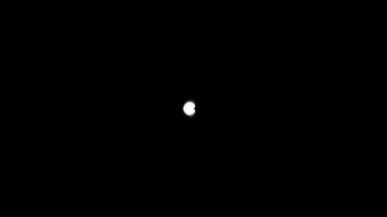

# shader_demos

A collection of some interesting shaders I've made. See the comments at the top of each file for an explanation of what they are.
Although all of these are made for demonstration in ShaderToy, several were originally in HLSL for Unity or UE4 projects.

